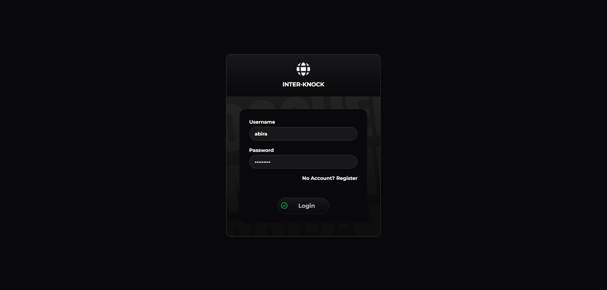
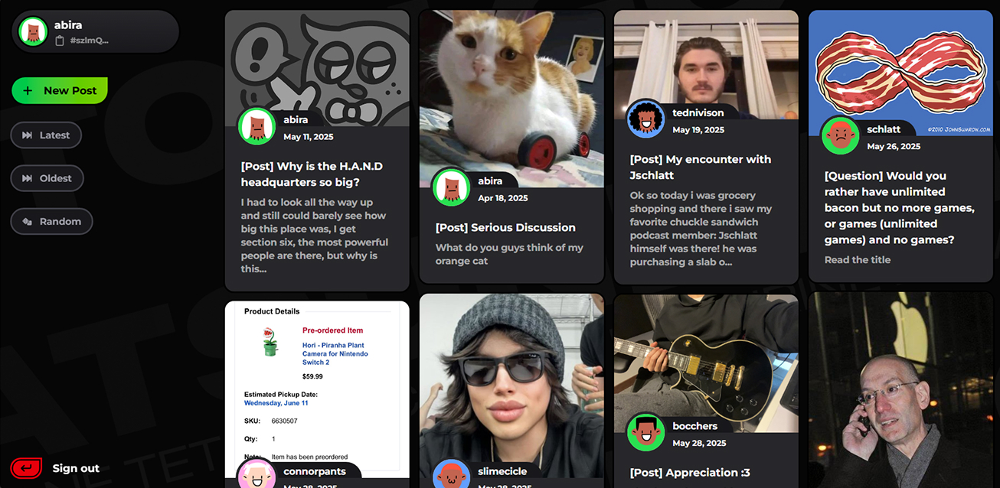
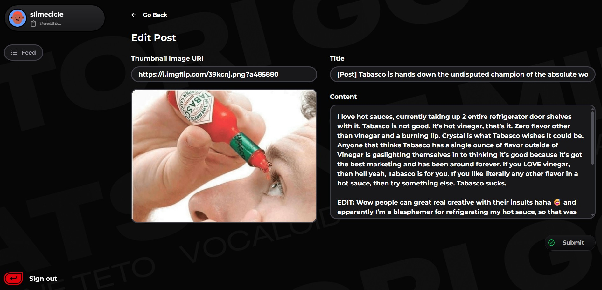

# Inter Knock

Decentralized P2P Social Media App using [GUN](https://github.com/amark/gun). Experimental project to try what’s possible with decentralized databases

## Features

- **User Authentication**


- **CRUD functionality for Posts** 





## Usage

A little ironic, but relay server is needed for reliable syncing with peers.

1. Create a new directory eg. `inter-knock-relay` or what you prefer
2. Install the following dependencies
```bash
npm i gun express cors
```
3. Create a new file eg. `server.js` and paste the following code 
```javascript

const Gun = require('gun');
const express = require('express');
const app = express();
const http = require('http').createServer(app);
const cors = require('cors')

app.use(express.static(__dirname));
app.use(cors());

const gun = Gun({
  web: http,
  file: 'data', // directory to store data, optional
  peers: []     // you can specify peer URLs here to connect to other relays
});

// Start the server
const PORT = process.env.PORT || 8765;
http.listen(PORT, () => {
  console.log(`GUN relay server running on http://localhost:${PORT}/gun`);
});
```
4. Run the server 

